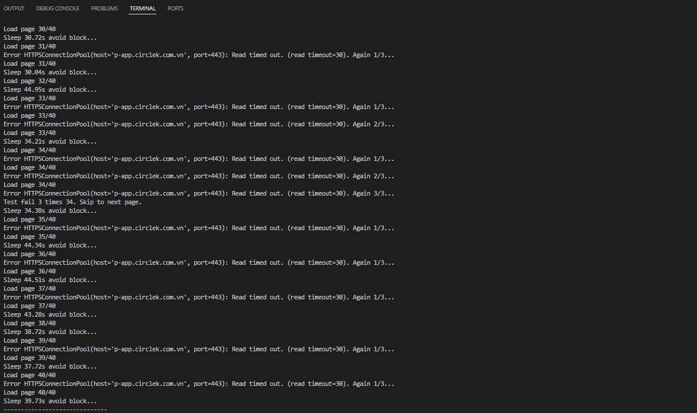
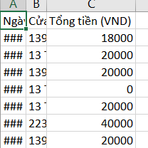
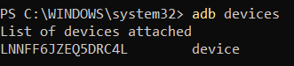
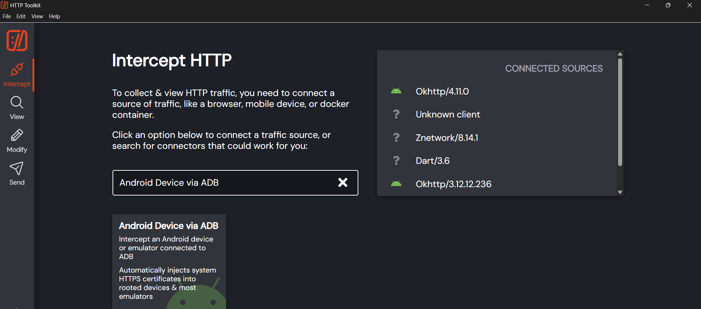
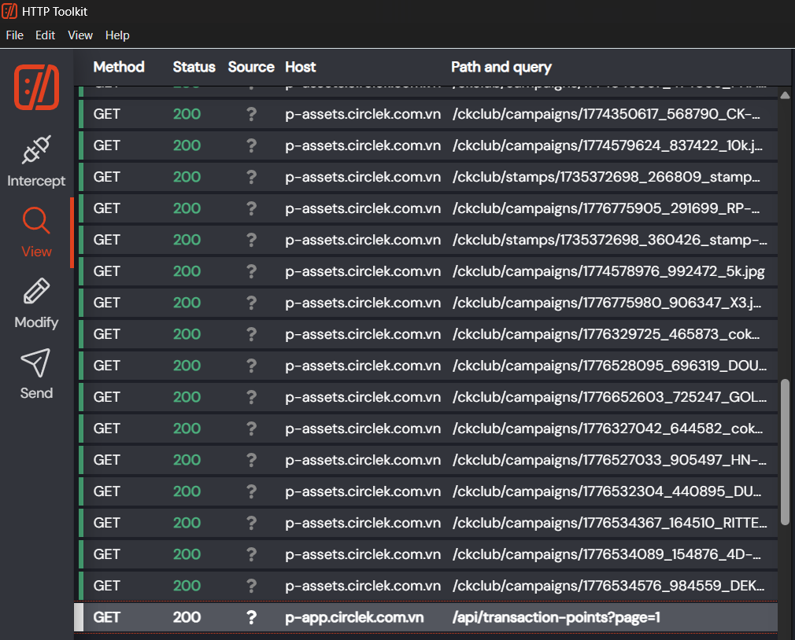
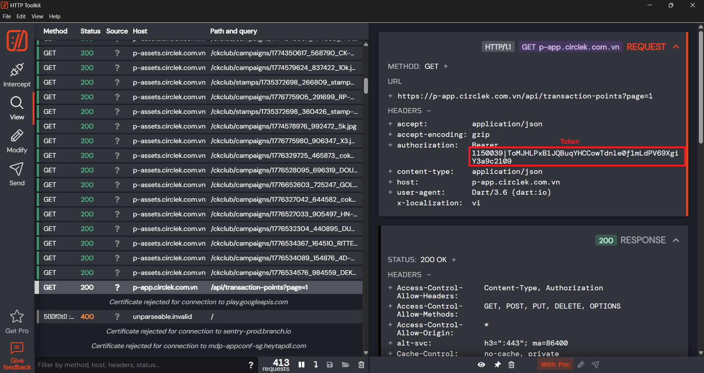
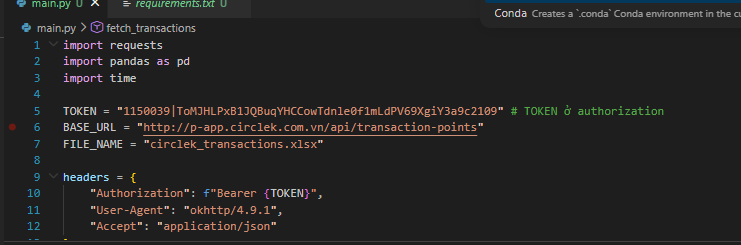

# ## Circle K History Exporter

### Công cụ Python giúp sao lưu toàn bộ lịch sử giao dịch từ app Circle K Việt Nam ra file Excel.

#### Chạy thử:



#### Kết quả:



### ## Hướng dẫn nhanh

#### 1. Chuẩn bị môi trường

Đảm bảo bạn đã cài đặt Python 3.10+. Mở Terminal (hoặc CMD/PowerShell) tại thư mục project và thực hiện các bước sau:

```powershell
# Tạo môi trường ảo
python -m venv .venv

# Kích hoạt (Windows)
.\.venv\Scripts\activate 

# Cài đặt thư viện
pip install -r requirements.txt
```

#### 2. Download Http Toolkit: [Download HTTP Toolkit for Windows Installer](https://httptoolkit.com/download/win-exe/)

#### 3. Gỡ lỗi USB, bật Chế độ nhà phát triển trên ĐT, connect với điện thoại



#### 4. Mở app Circle K - giao dịch


#### 5. Mở Http Toolkit - bật Android Device via ADB



#### 6. Lấy API transaction



#### 7. Lấy token (Đã login trong app Circle K và bật app)



#### 8. Coppy và dán token



#### 9. Chạy python ở powershell

```powershell
python main.py
```
